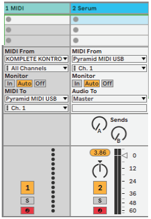

# Squarp Pyramid Notes

## Maschine + Squarp
Goal: to use Maschine as MIDI input for squarp (velocity ghost notes)
1. Open ableton
2. Set Midi track one to Maschine Instance
3. Squarp: press track -> hold down "channel" and rotate knob to select USB CH1
4. Test by pressing "Live" and playing some Notes
5.
## Sequence Chords
- open ableton live
- midi track 1:
  - MIDI IN from keyboard controller
  - MIDI OUT to Pyramid MIDI USB: CH1
- midi track 2: VST (serum)
  - MIDI IN from Pyramid MIDI USB: CH1
  - Audio to master
- Play a chord on keyboard (now stored in Pyramid memory)
- click `Step` mode, then `play`, and experiment with different sequence locations
- Play another chord, and repeat.
- Double track length: ...*look this up*

### experiment with Launchpad Pro chord feature.

## [Loopop comprehensive tutorial](https://www.youtube.com/watch?v=E5FZSKcsLxI&t=718s)

## [Strumming tutorial](https://www.youtube.com/watch?v=CVFR3aqd2n4&t=73s)

## [Arpeggiator, Euclidian sequencer and FX Tutorial](https://www.youtube.com/watch?v=k9nEvl19U34)

